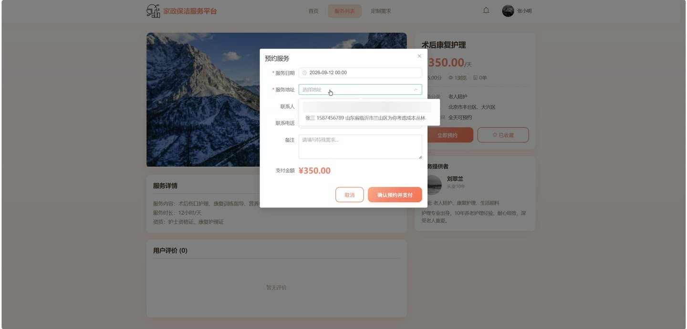
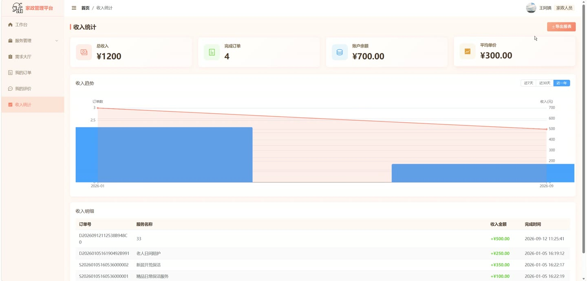
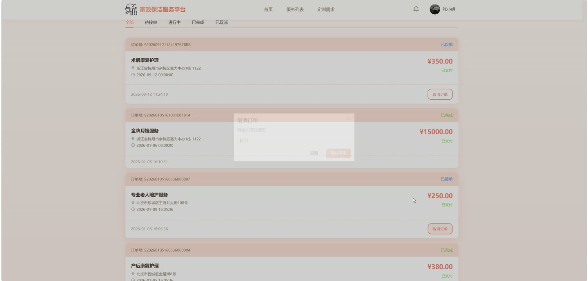

# (附文档)Python+Django+Vue3 家政保洁服务管理平台

**技术栈**：Python、Django、Vue3、MySQL

### 系统简介

本系统是一套基于 Django + Vue3 前后端分离架构的家政保洁服务管理平台，包含普通用户端、家政人员端与管理员端三类角色。用户可在线浏览与预约家政服务、发布定制需求、下单支付并评价；家政人员可发布服务、接单、管理收入；管理员负责审核、分类、订单、公告与数据统计等全局运营管理。
 
### 核心功能
 
### 普通用户端

 
- 注册与登录：支持用户名密码登录、注册、退出登录，可按用户名与手机号重置密码。 
- 首页浏览：展示轮播图、服务分类、热门服务（按订单量与评分排序）、平台公告与平台优势介绍。 
- 搜索服务：在首页搜索框输入关键词跳转服务列表，支持按关键词检索服务标题与详情。 
- 服务列表与筛选：按分类、关键词、价格区间、服务区域筛选服务，支持分页浏览。 
- 服务详情：查看服务封面、图片、价格、计价单位、服务详情、可预约时间、服务区域，并自动累计浏览次数。 
- 收藏服务：在服务详情页收藏或取消收藏，在"我的收藏"中分页查看收藏的服务。 
- 地址管理：新增、编辑、删除收货地址，设置默认地址，填写省市区与详细地址。 
- 发布定制需求：填写需求标题、服务类型、预算区间、期望时间、服务地址、联系人与电话、详细说明。 
- 需求大厅：查看全部需求或"我的发布"，按状态展示待接单/已接单/进行中/已完成/已取消，可取消自己待接单的需求。 
- 下单与支付：对服务下单，填写服务日期、地址、联系人、电话与备注，支持订单支付与退款。 
- 订单管理：查看订单列表与订单详情，跟踪订单状态与支付状态。 
- 评价管理：对已完成订单进行评价，包含服务态度、工作质量、准时性三项评分，支持上传图片与匿名评价。 
- 消息通知：查看订单、评价、系统、需求等类型消息，支持标记已读。
 
### 家政人员端

 
- 注册申请：填写用户名、密码、真实姓名、手机号、身份证号、工作经验、服务技能、服务区域、个人简介，并上传身份证照片与技能证书照片，提交后等待审核。 
- 登录限制：账号处于待审核、已驳回或已禁用状态时无法登录，并提示相应原因。 
- 个人信息维护：修改昵称、手机号、邮箱、头像，以及真实姓名、服务技能、工作经验、服务区域、个人简介。 
- 发布服务：填写服务标题、分类、价格、计价单位、封面、展示图片、服务详情、可预约时间与服务区域，提交后进入待审核状态。 
- 我的服务：查看自己发布的服务列表，编辑服务信息或删除服务。 
- 需求大厅：浏览用户发布的定制需求，按分类、预算区间、区域、关键词筛选，对需求进行接单。 
- 我的订单：查看自己接单的订单列表与详情，跟踪订单状态。 
- 我的评价：查看用户对自己服务的评价内容与各项评分。 
- 收入统计：查看总收入、总订单数，以及按月统计的收入趋势图。 
- 工作台：查看总订单数、总收入、平均评分、评价数量，以及评分分布柱状图。
 
### 管理员端

 
- 登录：使用管理员账号登录后台管理面板。 
- 工作台：查看注册用户数、家政人员数、总订单数、总成交额、待审核人员、待审核服务、今日订单、今日收入等指标。 
- 数据图表：查看订单趋势折线图与服务分类占比饼图。 
- 用户管理：按角色、状态、关键词筛选用户，分页查看用户列表，新增、编辑、删除用户。 
- 家政人员审核：查看待审核家政人员，执行通过或驳回操作，驳回时填写驳回原因。 
- 服务分类管理：新增、编辑、删除服务分类，支持一级与二级分类、图标、排序、参考价格与描述，删除前校验是否存在子分类。 
- 服务审核：查看待审核服务，执行通过或驳回，驳回时填写驳回原因。 
- 订单管理：查看全部订单，按状态与关键词筛选，跟踪订单与支付状态。 
- 需求管理：查看全部定制需求，按分类、状态、预算、区域筛选。 
- 评价管理：查看全部评价，控制评价是否显示，删除评价并填写删除原因。 
- 轮播图管理：新增、编辑、删除轮播图，设置标题、图片、链接、排序与启用状态。 
- 公告管理：新增、编辑、删除公告，设置标题、内容、展示范围（全平台/普通用户/家政人员）与起止时间。 
- 数据统计：查看平台统计数据，并支持导出 Excel 报表。
 
### 技术栈

 后端框架Python + Django + Django REST Framework ORMDjango ORM（支持 Q 查询、聚合 Sum/Count/Avg、按月按日分组统计） 权限与认证基于 Session 的角色认证（普通用户/家政人员/管理员） 前端框架Vue3 + Vue Router UI 组件库Element Plus 状态管理Pinia 构建工具Vite 图表库ECharts 数据库MySQL 报表导出openpyxl
 
### 交付内容

 
- 后端完整源码 
- 前端完整源码 
- 数据库初始化脚本 
- 万字文档

## 界面展示

---

## 获取完整源码 + 万字文档

本仓库为项目介绍页。**完整前后端源码、数据库初始化脚本、万字项目文档**，请加微信 `kangkangcode`，或访问 [codekk.top](http://codekk.top) 获取。

可作课程设计 / 毕业设计参考，支持远程部署调试。